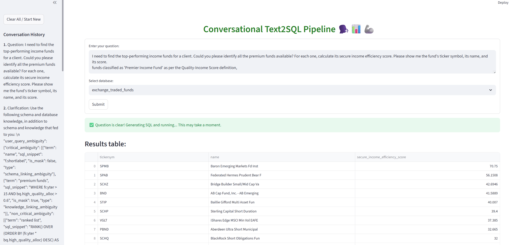
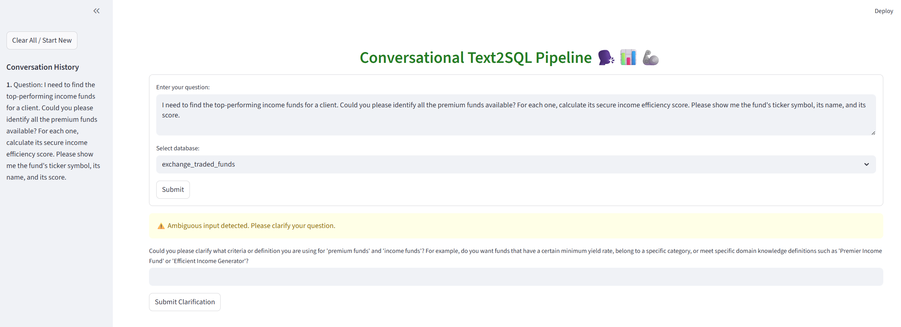
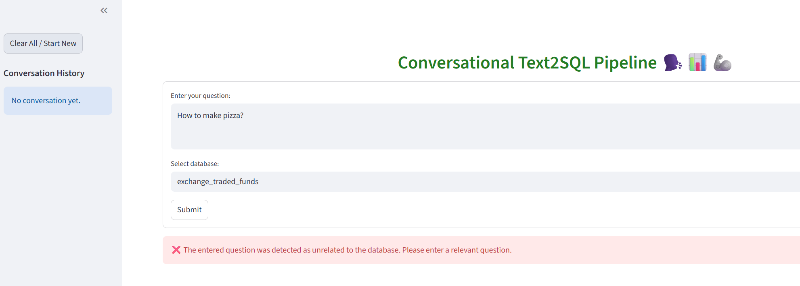

# Conversational Text-to-SQL

**TALK WITH YOUR TABLES !! 🗣️📊🦾**

A highly extensible, multimodal AI project that lets you interact with your PostgreSQL databases using natural language. Simply enter a question, select a database, and receive an accurate SQL query generated and executed by an LLM-powered CrewAI agent team. Enjoy a polished Streamlit UI experience, deep debuggability, and agent collaboration — all open source.

---

# Directory Structure

```
conversational-txt2sql/
├── data/                         # Database schema, column descriptions, and knowledge base files
├── docs/
│   └── images/                   # Example images of the UI (see below)
├── src/
│   └── conversational_txt2sql/
│       ├── __init__.py           # Package marker
│       ├── call_api.py           # Unified API client for OpenAI and other LLMs
│       ├── evaluation.py         # LLM-based SQL query comparison (LLM as judge)
│       ├── main_pipeline.py      # Main pipeline for text-to-SQL conversion and evaluation
│       ├── prompt.py             # Prompt generation for LLMs
│       └── ui.py                 # Streamlit UI for interactive SQL generation
├── pyproject.toml                # Project metadata and dependency management
├── README.md                     # Project documentation (this file)
```

---

# UI Images

One of the highlights of `conversational-txt2sql` is its modern, responsive Streamlit UI. The interface guides you step-by-step from question entry to SQL validation and result exploration — and adapts automatically based on the clarity and context of your question.

Below are visual examples from actual project usage, found in [`docs/images/`](docs/images/):


## 1. Query is Clear ✨

When your natural language question is well-formed and unambiguous, the UI transitions smoothly to SQL generation and result preview. You'll see:

- The original question,
- The generated SQL query,
- The executed results as a data table,
- Download button for easy export,
- Optional traces for full transparency.



---

## 2. Query is Ambiguous 🤔

If your question contains ambiguous phrasing, or the system detects multiple possible interpretations, the UI prompts you with clarifying questions. This ensures that your intent is captured precisely before generating any SQL.

- Context-aware ambiguity warnings
- List of detected ambiguous terms or concepts
- Opportunities to disambiguate or rephrase (handled conversationally)
- Once resolved, the pipeline proceeds as usual



---

## 3. Query is Unrelated/Unsupported 🚫

If the user query is irrelevant to the loaded schema, demands unavailable external information, or cannot be mapped to the known database, the UI displays a clear, friendly message:

- Explains why the query is not currently supported
- (Optionally) provides hints, suggestions, or links to supported queries
- Prevents hallucinated or unsafe SQL from running



---

These images illustrate how the UI guides users to correct, actionable results, and never leaves them guessing. For more context on the UX logic, see the code in [`src/conversational_txt2sql/ui.py`](src/conversational_txt2sql/ui.py) and explore the image gallery in [`docs/images/`](docs/images/).

---

# Add Environment Variables

To manage environment variables, create a file named `.env` in the project root directory. Add your API keys and configuration settings in this file. Example:

```env
OPENAI_API_KEY=your_openai_api_key_here
DATABASE_URL=your_database_connection_string
OTHER_ENV_VAR=your_value
```

**Note:**  
- Never commit your `.env` file to version control.  
- Update `.gitignore` to include `.env` if not already present.
- Access these variables in your code using libraries like `python-dotenv`.

----

# Install Dependencies

Install all dependencies (including UI) using [uv](https://github.com/astral-sh/uv):

```bash
uv sync --all-groups
```

## 2. Run the Streamlit UI

```bash
uv run streamlit run src/conversational_txt2sql/ui.py
```

## 3. Run the Main Pipeline (CLI)

```bash
uv run txt2sql_pipeline
```

## 4. Project Scripts

You can also run scripts defined in `pyproject.toml` using `uv run <script_name>`, but for Streamlit apps, always use `streamlit run`.


----

# 🐘 Setting Up PostgreSQL with Docker

To quickly get started with a local PostgreSQL database (matching the expected configuration for this project), we recommend using Docker Compose.

## 1. Launch the PostgreSQL Container

1. Open a terminal and navigate to the `scripts/build_postgres_container` directory:

    ```bash
    cd scripts/build_postgres_container
    ```

2. Start the PostgreSQL service:

    ```bash
    docker compose up --build
    ```

This command builds (if necessary) and runs a PostgreSQL container in the background.

> **Tip:** The default configuration uses `user=root`, `password=123123`, and `port=5432` (see `scripts/build_postgres_container/Dockerfile.postgresql`). By default, the database name will look like `exchange_traded_funds_template` (note the `_template` suffix), unless otherwise specified.


---

## 2. Test Your Connection with Python

After the container is running, verify the database is accessible using the following Python snippet:

```python
import psycopg2

# Update these parameters if your configuration is different:
conn = psycopg2.connect(
    dbname="exchange_traded_funds_template",  # Use the "_template" suffix
    user="root",
    password="123123",
    host="localhost",
    port=5432,
)

cursor = conn.cursor()

cursor.execute("""
    SELECT table_name
    FROM information_schema.tables
    WHERE table_schema = 'public'
    ORDER BY table_name;
""")

for row in cursor.fetchall():
    print(row)

cursor.close()
conn.close()
```

The code above will print all public tables in your PostgreSQL instance, confirming a successful connection.

---

# Conversational Agents & CrewAI Architecture 🧠🤖

## Multi-Agent Collaboration with CrewAI

At the heart of this project is a **CrewAI-powered multi-agent architecture**: each agent is designed for a specialized task, and together they transform your natural language question into precise SQL and actionable database results.

**Why CrewAI?** CrewAI lets us build a robust 'team' of expert agents that communicate and collaborate transparently—yielding reliable, debuggable, and profoundly accurate SQL translation.

---

### 🥇 The Agents — Who Does What?

1. **SQL Generator Agent**
   - **Role**: _Expert Postgres SQL Architect & Complex Query Interpreter_
   - **Goal**: Converts your natural language question and database schema into a highly accurate, production-ready SQL query—grounded strictly in the known schema and definitions.
   - **Superpowers**:
     - Deep schema/column analysis.
     - Handles ambiguity with clarifying questions internally (and can ask for more context from the Executor agent).
     - Only outputs SQL—no explanations, no comments!
   - **Delegation**: Collaborates with the Executor agent for troubleshooting difficult queries.

2. **SQL Executor & Debugger Agent**
   - **Role**: _Advanced SQL Execution Engineer, Query Validator & Troubleshooting Maestro_
   - **Goal**: Executes the generated SQL query, validates correctness, and provides debugging if the first attempt fails. Returns clear, tabular results—and if things break, steps through errors to iteratively repair the query.
   - **Superpowers**:
     - Detects failures (syntax/data/permissions/logic).
     - Diagnoses and explains root causes.
     - Attempts auto-fixes for SQL issues (rooted in the schema) and re-executes.
     - Collaborates directly with the SQL Generator agent for creative recovery (never guessing, always traceable to schema).

---

### 🚦 The CrewAI Pipeline: How Agents Work Together

1. **User submits a natural language question and selects a database.**
2. **Ambiguity-clarification loop (via LLM):** Is the question clear? If not, the user is prompted for clarifications, iteratively, until intent is unambiguous.
3. **SQL Generator Agent** takes the clarified input and produces a best-possible PostgreSQL query, strictly using the schema/metadata provided.
4. **SQL Executor & Debugger Agent** receives the SQL, runs it against the target database, and:
    - If successful: returns tabular results.
    - If failed: performs deep error analysis, suggests and may auto-fix the query, and (if needed) consults with the SQL Generator agent for re-phrasing or creative solutioning.
5. **Results, errors, and troubleshooting traces are always displayed with full transparency.**

**Visual Overview:**

```
      ┌───────────────┐       ┌───────────────────────┐      ┌────────────────────────────────────────┐      ┌──────────────┐
User→│ UI/CLI Client │─────▶│  Ambiguity Resolver   │────▶│ SQL Generator Agent  →  Executor Agent │────▶│  Database   │
      └───────────────┘       └───────────────────────┘      └─────────────────┬─────────────┬────────┘      └──────────────┘
                                                                  ▲             │
                                                           Collaboration/       │
                                                             Clarifications     │
                                                                  │             ▼
                                                      ┌─────────────────────────────┐
                                                      │      Results/Errors         │
                                                      └─────────────────────────────┘
```

---

### 🔬 Agent Details from Configuration

- **Source YAML:** `src/conversational_txt2sql/agentic/config/agents.yaml`
    - Each agent is configured with a `role`, `goal`, and detailed `backstory` to drive skillful, context-grounded behaviors.
    - Both agents are permitted to delegate/collaborate for optimal results.
- **Tasks & Sequencing:**
    - **Source YAML:** `src/conversational_txt2sql/agentic/config/tasks.yaml`
    - Tasks are mapped one-to-one to agents and detail prompt construction and hand-off responsibilities.
    - Agents cannot hallucinate/guess schema: all troubleshooting is evidence-based!

### ✨ Extending the Crew
- Add new agents or capabilities by editing the agents.yaml and tasks.yaml files, then wiring them up in `crew.py`.
- The CrewAI framework makes it easy to build multi-agent research, analytics, or automation teams—just describe the new expertise and hook it into the crew!

---

For more details, see the [agent YAML configs](src/conversational_txt2sql/agentic/config/agents.yaml) and the actual crew code in [crew.py](src/conversational_txt2sql/agentic/crew.py).


# File Descriptions

- **data/**  
  Contains database-specific files: schema, column meanings, and knowledge base for prompt context.

- **docs/images/**  
  Example images from the UI, covering scenarios for clear, ambiguous, and unrelated queries.

- **src/conversational_txt2sql/call_api.py**  
  Handles all API calls to LLMs (OpenAI, etc.), supports both plain text and structured output.

- **src/conversational_txt2sql/evaluation.py**  
  Uses an LLM as a judge to compare two SQL queries, returning structured comparison results.

- **src/conversational_txt2sql/main_pipeline.py**  
  Main pipeline for running the text-to-SQL workflow: gets user input, generates prompt, calls LLM, extracts SQL, and (optionally) evaluates results.

- **src/conversational_txt2sql/prompt.py**  
  Generates a detailed prompt for the LLM using the question, database schema, column descriptions, and knowledge base.

- **src/conversational_txt2sql/database_utils.py**  
  Utilities for interacting with PostgreSQL databases, including connecting, executing SQL queries, and initializing databases from `.sql` dump files. Provides functions to execute queries and manage test or template databases.

- **src/conversational_txt2sql/ui.py**  
  Streamlit app for interactive use. Lets users enter a question, select a database, and view the generated SQL query with a fancy UI and response time.

- **pyproject.toml**  
  Project configuration, dependencies, scripts, and dependency groups for development and UI.

- **README.md**  
  This documentation file.

---

# Customization

- Add more databases by placing their schema and metadata in the `data/` directory.
- Extend the UI by editing `src/conversational_txt2sql/ui.py`.
- Change LLM models or API keys in `src/conversational_txt2sql/call_api.py`.

---

# License

MIT License

---

# Authors

MultiModal AI Bootcamp Team

